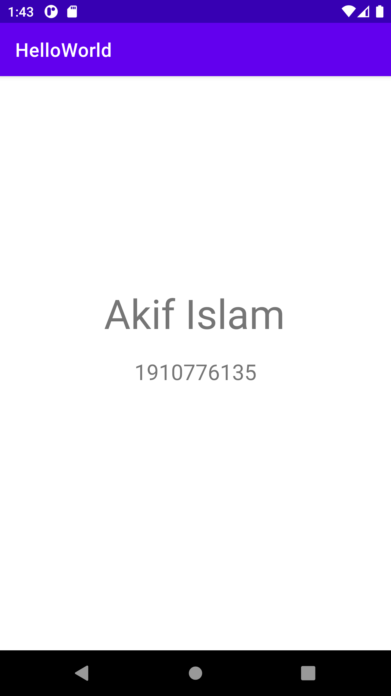

<h1 align="center">My First Hello World App on Android</h1>

## Assignment 0
- Course Name: Software Development Lab III
- Course Code: CSE-3162
- Teacher: [MD. OMAR FARUQE](https://github.com/omarfaruqe)

## Built With

- [Android Studio](https://developer.android.com/studio)
- [Kotlin](https://developer.android.com/kotlin) (Though didn't write a single line of kotlin code here)

## Preview

